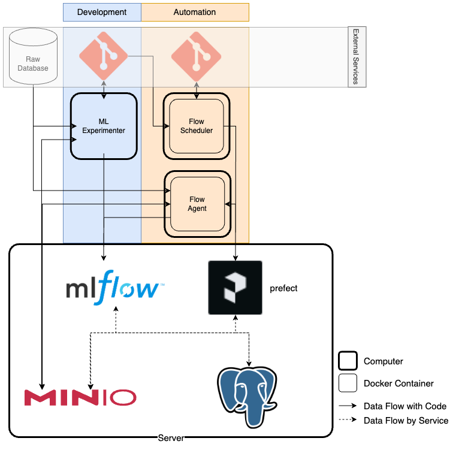

# MLOps-Sys

This project aims to build a straightforward MLOps system tailored to the model development pipeline. The MLOps system includes both local and distributed computing versions, with support for both CPU and GPU configurations.


# Preparation
1. Install packages - [`git`](https://git-scm.com/book/en/v2/Getting-Started-Installing-Git), [`conda`](https://conda.io/projects/conda/en/latest/user-guide/install/index.html#), [`docker`](https://docs.docker.com/engine/install/) 

> [!NOTE]
> docker-compose version >= 2.17.0

> [!WARNING]
> For Windows users, conducting all the following commands with [Git Bash](https://code.visualstudio.com/docs/sourcecontrol/intro-to-git#_git-bash-on-windows) is recommended.

2. Download this project
    ```bash
    git clone https://github.com/HsuHoward/MLOps-Sys.git
    ```
3. Enter the main folder of this project
    ```bash
    cd MLOps-Sys/mlops-sys
    ```


# System Architechure


## File Structure
Includes 4 services/functions
- Server `server`
- Development Environment `ml_experimenter`
- Flow Scheduling Function `flow_scheduler` 
- Flow Execution Service `flow_agent` 

> [!NOTE]
> You may deploy above 4 services/functions on one computer (`local version`) or 4 seperate computers (`distributed version`). In the `distributed version`, these computers are named `COMPUTER_1`, `COMPUTER_2`, `COMPUTER_3`, and `COMPUTER_4` in this document.
> Alos, if you choose to setup with  `distributed version`, you will need to conduct `Preparation` section for each computer.

<details><summary>Extension for File Stucture</summary>
<p>

```
.
├── LICENSE
├── README.md
├── dev-projects
│   └── example_project
│       ├── data
│       │   ├── green_tripdata_2021-01.parquet
│       │   └── green_tripdata_2021-02.parquet
│       ├── development.py
│       └── requirements.txt
├── flows
│   └── example_flow
│       ├── config
│       │   └── flow.yaml
│       ├── data
│       │   ├── green_tripdata_2021-01.parquet
│       │   └── green_tripdata_2021-02.parquet
│       ├── prefect_flow.py
│       └── requirements.txt
├── mlops-sys
│   ├── flow_agent
│   │   ├── .env
│   │   ├── .env.local
│   │   ├── Dockerfile.cpu
│   │   ├── Dockerfile.gpu
│   │   ├── docker-compose-cpu.yml
│   │   ├── docker-compose-gpu.yml
│   │   ├── docker-compose-local-cpu.yml
│   │   ├── docker-compose-local-gpu.yml
│   │   ├── requirements.txt
│   │   └── requirements_sys.txt
│   ├── flow_scheduler
│   │   ├── .env
│   │   ├── .env.local
│   │   ├── Dockerfile
│   │   ├── docker-compose-local.yml
│   │   ├── docker-compose.yml
│   │   ├── requirements_sys.txt
│   │   └── setup.py
│   ├── ml_experimenter
│   │   ├── .env
│   │   ├── .env.local
│   │   └── requirements_sys.txt
│   └── server
│       ├── .env
│       ├── .env.local
│       ├── docker-compose-local.yml
│       ├── docker-compose.yml
│       ├── init.sh
│       └── prefect_setting_s3.py
└── png # images for README.md
```

</p>
</details>

# Quick Start

## Step 0. Get your SERVER_IP
- If you want to deploy this MLOps system to multiple computers, firstly you need to get the IP of your server (i.e., `SERVER_IP`). 

    <details>
    <summary>Linux</summary>

    ```bash
    ifconfig $(ip route | awk '/default/ {print $5}') | awk '/inet/ {print $2}' | head -n 2

    # output
    # fe80::f1e6:5c46:af01:7b34   --> IPv6
    # 172.16.110.13               --> IPv4, choose this as SERVER_IP
    ```
    </details>

    <details> 
    <summary>Mac</summary>

    ```bash
    ifconfig $(netstat -rn | awk '/default/ {print $4}' | head -n 1) | awk '/inet/ {print $2}'

    # output
    # fe80::f1e6:5c46:af01:7b34   --> IPv6
    # 172.16.110.13               --> IPv4, choose this as SERVER_IP
    ```
    </details>

    <details><summary>Windows</summary>

    ```powershell
    ipconfig

    # output
    # Ethernet adapter Local Area Connection:
    #    Connection-specific DNS Suffix . . . . . . . . :
    #    Link-local IPv6 Address . . . . . . . . . : fe80::4bdb:1045:4d34:f1a4%13
    #    IPv4 Address . . . . . . . . . . . . . . .: 172.16.110.107  --> IPv4, choose this as SERVER_IP
    #    Subnet Mask . . . . . . . . . . . . . . . : 255.255.255.0    
    #    Default Gateway . . . . . . . . . . . . . : 172.16.110.1
    ```
    </details>

- If you want to deply this MLOps system to a single computer, you can skip this step.


## Step 1. Setup the Server - Server
We need to setup the `Server` as a control center.

```bash
# local version
docker compose -f server/docker-compose-local.yml --env-file server/.env.local up --build -d
```
```bash
# distributed version (within ### COMPUTER_1 ###)
export SERVER_IP=<YOUR_SERVER_IP> # replace <YOUR_SERVER_IP> with SERVER_IP from step 0
docker compose -f server/docker-compose.yml --env-file server/.env up --build -d
```

When `Server` is set within a minute, you will get 4 docker containers:
- MinIO (Container Name: `minio_s3`)
- MLflow (Container Name: `mlflow_server`)
- Prefect (Container Name: `prefect_server`)
- Postgres (Container Name：`postgres_db`)


Also, you may check the WebUI for the service:
> [!NOTE]
> Please replace the following  `IP` with `localhost` for the local version and with `SERVER_IP` obtained from the step 0 for the distributed version.
- MinIO (URL: `http://IP:9001`, account: `admin`, password: `adminsecretkey`)


- MLflow (URL: `http://IP:5050`)


- Prefect (URL: `http://IP:4200`)


## Step 2. Setup development environments - ml_experimenter
For the purpose of model development, you need to setup an environment connected to `Server`. More specifically, the development environment needs to connecto to  `MLflow server` on `Server` for model tracking and to `MinIO` on `Server` for `DVC` data tracking.

To do so, create an isolated environment is recommended. Here, a conda environment named `mlops` is created as a demonstration.
```bash
conda create -n mlops python=3.10 -y # create an isolated environment
conda activate mlops                 # enter the environment 
```

In the isolated development environment, environment variables are configured for the connection, and the corresponding packages are installed.
```bash
# local version
export PROJECT_NAME=my-project    # setup your own project name
source .env.local
pip install -r requirements_sys.txt
```
```bash
# distributed version (within ### COMPUTER_2 ###)
export PROJECT_NAME=my-project    # setup your own project name
export SERVER_IP=<YOUR_SERVER_IP> # replace <YOUR_SERVER_IP> with SERVER_IP from step 0
source .env
pip install -r requirements_sys.txt
```

Once the connection is established, you can initiate your development project. Optionally, you can track your code using git and monitor your data with dvc by configuring it with the following command:
``` bash
git init
dvc init
dvc remote add -f minio_s3 ${MINIO_S3_PROJECT_BUCKET}
dvc remote modify minio_s3 endpointurl ${MLFLOW_S3_ENDPOINT_URL}
```

> [!TIP]
> You may check the [example_project](./dev-projects//example_project) as a development demonstration.

Enjoy your model development!

## Step 3. Setup a schedule for your project - flow_scheduler
After completing your model development, you may want to set up a pipeline to retrain your model on a scheduled basis. The scheduling process involves uploading your pipeline to the `Prefect server` located on the `Server`.

To configure the schedule, you need to create a folder under `flows`(e.g., `example_flow`), and copy your project files (e.g., `example_project`) to the folder. Also, you will need to modify your code with `Prefect` module:
``` python
from prefect import flow, task

# To create a task, add flow decorator to your function
@task
def task1():
    pass

# To create a schedule flow, add flow decorator to your function
@flow
def main():
    pass
```

> [!NOTE]
> Please check [prefect_flow.py](./flows/example_flow/prefect_flow.py) for example.

Additionally, you'll be required to create a `config` folder within the `example_flow` folder and generate a `flow.yaml` file for schedule configuration under the `config` directory. Please check [`flow.yaml`](./flows/example_flow/config/flow.yaml) for the format and usage.


After completing the code for scheduling, initiate the scheduling of your project by:
```bash
# local version 
export FLOW_DIR=../../flows/example_flow # change example_flow to your folder name under ./flows # or set a absolute directory if you do not put your folder under ./flows
docker compose -f flow_scheduler/docker-compose-local.yml --env-file flow_scheduler/.env.local up --build
```
```bash
# distributed version (within ### COMPUTER_3 ###)
export SERVER_IP=<YOUR_SERVER_IP> # replace <YOUR_SERVER_IP> with SERVER_IP from step 0
export FLOW_DIR=../../flows/example_flow # change example_flow to your folder name under ./flows # or set a absolute directory if you do not put your folder under ./flows
docker compose -f flow_scheduler/docker-compose.yml --env-file flow_scheduler/.env up --build
```

You will observe the following log indicating that the schedule has been successfully uploaded.
```
Work pool named 'default-agent-pool' already exists. Please try creating your work pool again with a different name.
Found flow 'main'
Default '.prefectignore' file written to /root/flows/.prefectignore
Deployment YAML created at '/root/flows/main-deployment.yaml'.
Successfully uploaded 8 files to s3://prefect/main/model_training
Deployment 'main/model_training' successfully created with id
'b84cb77c-9a5b-4575-b603-4d95f84d0e3c'

To execute flow runs from this deployment, start an agent that pulls work from
the 'default-agent-pool' work pool:
$ prefect agent start -p 'default-agent-pool'
```

Now you may check the schedule on Prefect WebUI (URL: `http://IP:4200`) as the image below:
> [!NOTE]
> Please replace the following  `IP` with `localhost` for the local version and with `SERVER_IP` obtained from the step 0 for the distributed version.


## Step 4. Setup working agents to conduct schedules - flow_agent

Finally, you need to configure working agents to execute the schedules. You can allocate these agents to different resource pools, and each resource pool will be responsible for the flow you assign using the `flow.yaml` created in step 3.

You can set up a CPU/GPU agent using the following command. Additionally, within the computer resource (i.e., the number of CPU/GPU), you can configure multiple agents by executing the following command multiple times.

```bash
# local version
export POOL_NAME=default-agent-pool # allocate the agent to this resource pool 
export QUEUE_NAME=ml # project name
## create a cpu agent
docker compose -f flow_agent/docker-compose-local-cpu.yml --env-file flow_agent/.env.local up --build -d
## create a gpu agent
docker compose -f flow_agent/docker-compose-gpu.yml --env-file flow_agent/.env.local up --build -d
```
```bash
# distributed version (within ### COMPUTER_4 ###)
export SERVER_IP=<YOUR_SERVER_IP> # replace <YOUR_SERVER_IP> with SERVER_IP from step 0
export POOL_NAME=default-agent-pool # allocate the agent to this resource pool 
export QUEUE_NAME=ml # project name
## create a cpu agent
docker compose -f flow_agent/docker-compose-cpu.yml --env-file flow_agent/.env up --build -d
## create a gpu agent
docker compose -f flow_agent/docker-compose-gpu.yml --env-file flow_agent/.env up --build -d
```

Upon inspecting the container log of the `flow_agent`, you will observe information indicating that the agent is actively seeking tasks from the assigned resource pool.
```
Starting v2.10.9 agent connected to http://prefect_server:4200/api...

___ ___ ___ ___ ___ ___ _____     _   ___ ___ _  _ _____
| _ \ _ \ __| __| __/ __|_   _|   /_\ / __| __| \| |_   _|
|  _/   / _|| _|| _| (__  | |    / _ \ (_ | _|| .` | | |
|_| |_|_\___|_| |___\___| |_|   /_/ \_\___|___|_|\_| |_|


Agent started! Looking for work from work pool 'cpu_pool'...
```